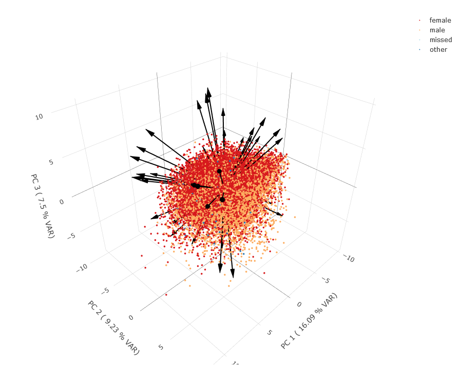

# triplotly

A flexible way of visualizing principal components of high dimensional
data with plotly

## App 
An interactive shiny app is hosted here: https://phit0.shinyapps.io/triplotly/  

  

Example Data from personality questionary data. [source](https://openpsychometrics.org)  
